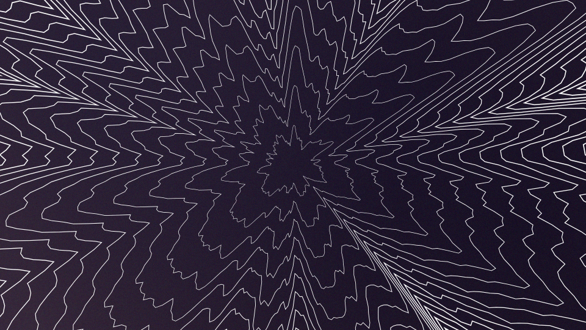

# Aluzja - Shivering Spotify animations

In 2023 I helped co-produce an album Shivering by my dear friend [Aluzja](https://linktr.ee/aluzja).
For the release on spotify I made some animations
in [p5.js](https://p5js.org/). Spotify sometimes stops showing them for unknown reasons
so I'm also uploading this repo for sanity checks that I didn't dream them up.

Animations are based on the album cover and the CD packaging graphic design.
Both made by the amazing [typez.co](https://typez.co/).

This project uses:

- [tapioca24/p5.capture](https://github.com/tapioca24/p5.capture)
- [patriciogonzalezvivo/GLSL-Noise.md](https://gist.github.com/patriciogonzalezvivo/670c22f3966e662d2f83)

## Running

For some reason this works better on chromium.
On Firefox i only got around 7-10 FPS while on chromium i got around 50-60 FPS.

¯\\_(ツ)_/¯

### Running online

Paste the contents of [sketch.js](./sketch.js) into the [web p5.js editor](https://editor.p5js.org/).

### Running locally

```sh
python3 -m http.server 8080
```

Then simply go to [http://0.0.0.0:8080](http://0.0.0.0:8080) in your browser.

## Gallery

The animation in it's current form can be customized via sliders:





